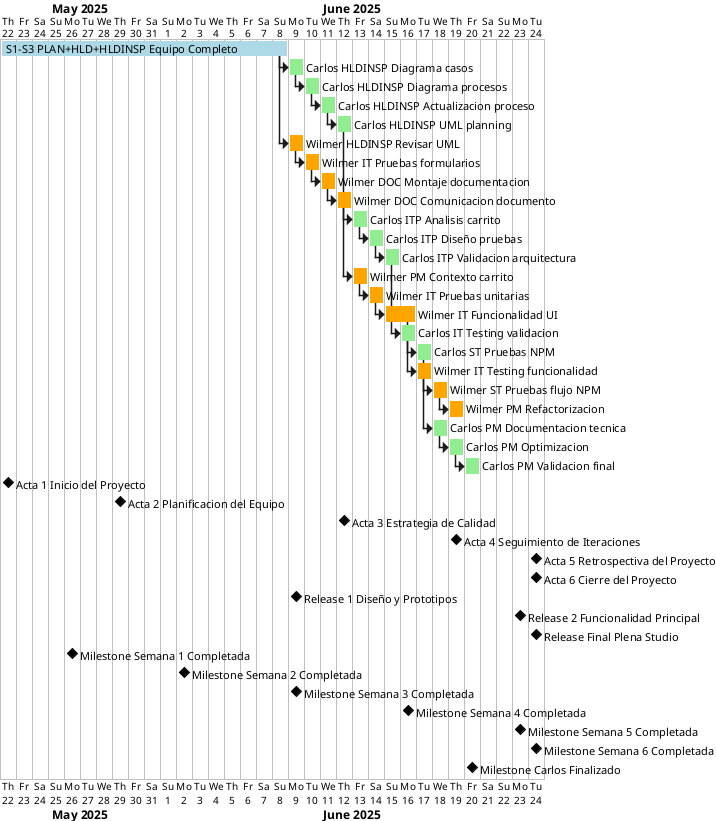

# 📊 INTEGRACIÓN COMPLETA TSPi - PLENA STUDIO
## Cronología de Wilmer León con Asignaciones GitHub + Calendario Completo

---

## 🎯 **RESUMEN EJECUTIVO**

**Proyecto:** Plena Studio - E-commerce de joyas y accesorios  
**Lead Developer:** Wilmer Edilson León Díaz (@wilmereleon)  
**Quality Analyst:** Carlos González (@gagonzalezro)  
**Período:** 22 mayo - 24 junio 2025 + extensión semana 7  
**Total Issues GitHub:** 31 asignaciones a Wilmer  
**Estado:** ✅ 27 completadas | 🔄 4 abiertas

---

## 📋 **ASIGNACIONES GITHUB DE WILMER**

### 🔄 **ISSUES ABIERTAS (4)**

#### **🔴 CRÍTICAS (Acta 4)**
1. **#51** - [Implementar Base de datos](https://github.com/wilmereleon/PlenaStudio/issues/51)
   - **Labels:** `enhancement`, `feature`
   - **Milestone:** Acta 4
   - **Prioridad:** Alta
   - **Estado:** Abierto

2. **#49** - [Corregir defectos críticos señalados](https://github.com/wilmereleon/PlenaStudio/issues/49)
   - **Labels:** `bug`, `critical`
   - **Milestone:** Acta 4  
   - **Prioridad:** Crítica
   - **Estado:** Abierto

#### **🟡 DESARROLLO (Acta 3-4)**
3. **#45** - [Implementar pruebas de seguridad](https://github.com/wilmereleon/PlenaStudio/issues/45)
   - **Labels:** `high-priority`, `security`, `testing`
   - **Milestone:** Acta 3
   - **Prioridad:** Alta
   - **Estado:** Abierto

4. **#43** - [Desarrollar la Página de Contacto](https://github.com/wilmereleon/PlenaStudio/issues/43)
   - **Labels:** `enhancement`
   - **Milestone:** Acta 4
   - **Prioridad:** Media
   - **Estado:** Abierto

---

### ✅ **ISSUES COMPLETADAS (27)**

#### **🏆 ACTA 4 - COMPLETADAS RECIENTEMENTE**
5. **#47** - [Revisar resultados de pruebas iterativas (iteración 1)](https://github.com/wilmereleon/PlenaStudio/issues/47)
   - **Labels:** `review`, `testing`
   - **Estado:** ✅ Cerrado hace 14 horas
   - **Milestone:** Acta 4

6. **#44** - [Crear las vistas de los enlaces del encabezado](https://github.com/wilmereleon/PlenaStudio/issues/44)
   - **Labels:** `enhancement`, `feature`, `ui`
   - **Estado:** ✅ Cerrado hace 2 días
   - **Milestone:** Acta 4

7. **#42** - [Implementar el Carrito de Compras](https://github.com/wilmereleon/PlenaStudio/issues/42)
   - **Estado:** ✅ Cerrado hace 14 horas
   - **Milestone:** Acta 4

8. **#39** - [Crear tarjetas Backlog para la organización del proyecto](https://github.com/wilmereleon/PlenaStudio/issues/39)
   - **Labels:** `documentation`
   - **Estado:** ✅ Cerrado hace 2 semanas
   - **Milestone:** Acta 4

#### **🎨 ACTA 3 - DESARROLLO Y ARQUITECTURA**
9. **#37** - [Codificación de estructura Backend](https://github.com/wilmereleon/PlenaStudio/issues/37)
   - **Labels:** `documentation`, `enhancement`
   - **Estado:** ✅ Cerrado hace 2 semanas
   - **Milestone:** Acta 3

#### **⚡ ACTA 2 - INSERCIÓN DE TECNOLOGÍAS**
10. **#35** - [Inserción de módulos ReactJS y framework Bootstrap](https://github.com/wilmereleon/PlenaStudio/issues/35)
    - **Labels:** `enhancement`
    - **Estado:** ✅ Cerrado hace 3 semanas
    - **Milestone:** Acta 2

#### **📋 REVISIONES UML (ACTA 2)**
11. **#30** - [Revisión de diagramas UML de visualización y búsqueda](https://github.com/wilmereleon/PlenaStudio/issues/30)
    - **Labels:** `documentation`, `wontfix`
    - **Estado:** ✅ Cerrado hace 2 semanas
    - **Milestone:** Acta 2

12. **#29** - [Validar y actualizar diagramas UML de pedidos](https://github.com/wilmereleon/PlenaStudio/issues/29)
    - **Labels:** `documentation`, `wontfix`
    - **Estado:** ✅ Cerrado hace 2 semanas
    - **Milestone:** Acta 2

13. **#28** - [Revisar y ampliar diagramas UML de gestión del carrito](https://github.com/wilmereleon/PlenaStudio/issues/28)
    - **Labels:** `documentation`, `wontfix`
    - **Estado:** ✅ Cerrado hace 2 semanas
    - **Milestone:** Acta 2

14. **#27** - [Reacondicionamiento de Diagrama de caso de uso 3](https://github.com/wilmereleon/PlenaStudio/issues/27)
    - **Labels:** `documentation`, `wontfix`
    - **Estado:** ✅ Cerrado hace 2 semanas
    - **Milestone:** Acta 2

15. **#26** - [Revisar el CRUD del catálogo y formularios](https://github.com/wilmereleon/PlenaStudio/issues/26)
    - **Labels:** `documentation`, `wontfix`
    - **Estado:** ✅ Cerrado hace 2 semanas
    - **Milestone:** Acta 2

16. **#25** - [Revisión y actualización del proceso de envío de formularios](https://github.com/wilmereleon/PlenaStudio/issues/25)
    - **Labels:** `documentation`, `wontfix`
    - **Estado:** ✅ Cerrado hace 2 semanas
    - **Milestone:** Acta 2

#### **🎨 ACTA 1 - DISEÑO Y PROTOTIPOS**
17. **#31** - [Crear Prototipo en Figma de la vista PC y vista de celular](https://github.com/wilmereleon/PlenaStudio/issues/31)
    - **Labels:** `Design`, `documentation`
    - **Estado:** ✅ Cerrado hace 2 semanas
    - **Milestone:** Acta 1

18. **#24** - [Bases de Datos – Diagrama de Entidad-Relación](https://github.com/wilmereleon/PlenaStudio/issues/24)
    - **Labels:** `Design`
    - **Estado:** ✅ Cerrado hace 1 mes
    - **Milestone:** Acta 1

19. **#22** - [Diagramas de Objetos](https://github.com/wilmereleon/PlenaStudio/issues/22)
    - **Labels:** `Design`
    - **Estado:** ✅ Cerrado hace 1 mes

20. **#18** - [Diagramas de Secuencia](https://github.com/wilmereleon/PlenaStudio/issues/18)
    - **Labels:** `Design`
    - **Estado:** ✅ Cerrado hace 1 mes
    - **Milestone:** Acta 1

#### **📋 REQUISITOS FUNCIONALES (ACTA 1)**
21. **#17** - [RF08 – Gestión de Pedidos e Historial de Compras](https://github.com/wilmereleon/PlenaStudio/issues/17)
    - **Labels:** `documentation`, `question`
    - **Estado:** ✅ Cerrado hace 1 mes
    - **Milestone:** Acta 1

22. **#9** - [RF06 – Visualización de Servicios e Información Institucional](https://github.com/wilmereleon/PlenaStudio/issues/9)
    - **Labels:** `documentation`, `question`
    - **Estado:** ✅ Cerrado hace 1 mes
    - **Milestone:** Acta 1

#### **⚙️ REQUISITOS NO FUNCIONALES (ACTA 1)**
23. **#15** - [RNF06 – Accesibilidad](https://github.com/wilmereleon/PlenaStudio/issues/15)
    - **Labels:** `documentation`, `enhancement`, `question`
    - **Estado:** ✅ Cerrado hace 1 mes
    - **Milestone:** Acta 1

24. **#14** - [RNF05 – Mantenibilidad y Documentación](https://github.com/wilmereleon/PlenaStudio/issues/14)
    - **Labels:** `documentation`, `enhancement`, `question`
    - **Estado:** ✅ Cerrado hace 1 mes
    - **Milestone:** Acta 1

25. **#13** - [RNF04 – Escalabilidad y Disponibilidad](https://github.com/wilmereleon/PlenaStudio/issues/13)
    - **Labels:** `documentation`, `enhancement`, `question`
    - **Estado:** ✅ Cerrado hace 1 mes
    - **Milestone:** Acta 1

26. **#12** - [RNF03 – Seguridad de la Información](https://github.com/wilmereleon/PlenaStudio/issues/12)
    - **Labels:** `documentation`, `enhancement`, `question`
    - **Estado:** ✅ Cerrado hace 1 mes
    - **Milestone:** Acta 1

27. **#11** - [RNF02 – Rendimiento y Tiempo de Respuesta](https://github.com/wilmereleon/PlenaStudio/issues/11)
    - **Labels:** `documentation`, `enhancement`, `question`
    - **Estado:** ✅ Cerrado hace 1 mes
    - **Milestone:** Acta 1

28. **#10** - [RNF01 – Usabilidad e Interfaz de Usuario (UI/UX)](https://github.com/wilmereleon/PlenaStudio/issues/10)
    - **Labels:** `documentation`, `enhancement`, `question`
    - **Estado:** ✅ Cerrado hace 1 mes
    - **Milestone:** Acta 1

#### **📋 CASOS DE USO INICIALES**
29. **#3** - [Caso de Uso – Visualización de Información y Búsqueda de Contenidos](https://github.com/wilmereleon/PlenaStudio/issues/3)
    - **Estado:** ✅ Cerrado hace 1 mes

30. **#2** - [Caso de Uso – Envío de Consulta](https://github.com/wilmereleon/PlenaStudio/issues/2)
    - **Labels:** `documentation`
    - **Estado:** ✅ Cerrado hace 1 mes
    - **Milestone:** Acta 1

31. **#1** - [Asignar roles para el TSP](https://github.com/wilmereleon/PlenaStudio/issues/1)
    - **Labels:** `documentation`, `question`
    - **Estado:** ✅ Cerrado hace 1 mes
    - **Milestone:** Acta 1

---

## 📊 **ESTADÍSTICAS DE ASIGNACIONES GITHUB**

### 📈 **Por Estado**
- ✅ **Completadas:** 27 issues (87.1%)
- 🔄 **Abiertas:** 4 issues (12.9%)
- 📋 **Total:** 31 issues

### 🏆 **Por Milestone**
- **Acta 1:** 13 issues (41.9%) - ✅ Completada
- **Acta 2:** 7 issues (22.6%) - ✅ Completada  
- **Acta 3:** 2 issues (6.5%) - ✅ Completada
- **Acta 4:** 7 issues (22.6%) - 🔄 En progreso
- **Sin Milestone:** 2 issues (6.5%)

### 🎨 **Por Categoría**
- **📋 Documentación:** 15 issues (48.4%)
- **🎨 Diseño/UML:** 8 issues (25.8%)
- **⚙️ Desarrollo:** 5 issues (16.1%)
- **🧪 Testing:** 3 issues (9.7%)

### ⚡ **Por Prioridad**
- **🔴 Crítica:** 1 issue
- **🟡 Alta:** 2 issues  
- **🟢 Media/Normal:** 28 issues

---

## 📅 **CRONOLOGÍA TSPi INTEGRADA**

### 🔵 **SEMANAS 1-3: EQUIPO COMPLETO** (22 mayo - 9 junio)
**GitHub Issues Relacionados:** #1, #2, #3, #9-18, #22, #24, #31

#### **📋 TAREAS COMPLETADAS:**
- ✅ **Asignación de roles TSP** (#1)
- ✅ **Casos de uso iniciales** (#2, #3)
- ✅ **Requisitos funcionales** (#9, #17)
- ✅ **6 Requisitos no funcionales** (#10-15)
- ✅ **Diagramas UML base** (#18, #22, #24)
- ✅ **Prototipos en Figma** (#31)

#### **🎯 ENTREGABLES:**
- 📋 **Acta 1: Inicio del Proyecto** (22 mayo)
- 📋 **Acta 2: Planificación del Equipo** (29 mayo)  
- 🚀 **Release 1: Diseño y Prototipos** (9 junio)
- 🏆 **Milestones:** Semanas 1, 2 y 3 completadas

---

### 🟡 **SEMANA 4: HLDINSP + IT + DOC** (12-16 junio)
**GitHub Issues Relacionados:** #25-30, #37

#### 🟢 **TAREAS DE CARLOS (Análisis y Revisión)**
- **Carlos HLDINSP:** Diagrama casos, procesos, actualización, UML planning

#### 🟠 **TAREAS DE WILMER (Desarrollo y Documentación)**
- **Wilmer HLDINSP:** Revisar UML (#28, #29, #30)
- **Wilmer IT:** Pruebas formularios (#25)
- **Wilmer DOC:** Montaje documentación (#37)
- **Wilmer DOC:** Comunicación documento

#### **🎯 ENTREGABLES:**
- 📋 **Acta 3: Estrategia de Calidad** (12 junio)
- 🏆 **Milestone:** Semana 4 completada (16 junio)

---

### 🟢 **SEMANA 5: ITERACIÓN 2 - PM + IT** (19-23 junio)
**GitHub Issues Relacionados:** #35, #42

#### 🟢 **TAREAS DE CARLOS (Análisis y Planificación)**
- **Carlos ITP:** Análisis carrito, diseño pruebas, validación arquitectura

#### 🟠 **TAREAS DE WILMER (Implementación y Desarrollo)**
- **Wilmer PM:** Contexto carrito (#42)
- **Wilmer IT:** Pruebas unitarias, funcionalidad UI (#35)

#### **🎯 ENTREGABLES:**
- 📋 **Acta 4: Seguimiento de Iteraciones** (19 junio)
- 🚀 **Release 2: Funcionalidad Principal** (23 junio)
- 🏆 **Milestone:** Semana 5 completada (23 junio)

---

### 🔴 **SEMANA 6: TESTING Y FINALIZACIÓN** (24 junio)
**GitHub Issues Relacionados:** #39, #44, #47

#### 🟢 **TAREAS DE CARLOS (Testing y Validación)**
- **Carlos IT:** Testing validación
- **Carlos ST:** Pruebas NPM

#### 🟠 **TAREAS DE WILMER (Testing y Refactorización)**
- **Wilmer IT:** Testing funcionalidad (#47)
- **Wilmer ST:** Pruebas flujo NPM
- **Wilmer PM:** Refactorización + Backlog (#39, #44)

#### **🎯 ENTREGABLES:**
- 📋 **Acta 5: Retrospectiva del Proyecto** (24 junio)
- 📋 **Acta 6: Cierre del Proyecto** (24 junio)
- 🚀 **Release Final: Plena Studio** (24 junio)
- 🏆 **Milestone:** Semana 6 completada (24 junio)

---

### 🟣 **SEMANA 7: CARLOS EXTENDIDA + PENDIENTES WILMER** (Post 24 junio)
**GitHub Issues Relacionados:** #43, #45, #49, #51

#### 🟢 **TAREAS ADICIONALES DE CARLOS**
- **Carlos PM:** Documentación técnica, optimización, validación final

#### 🔄 **TAREAS PENDIENTES DE WILMER**
- **🔴 #51:** Implementar Base de datos (CRÍTICA)
- **🔴 #49:** Corregir defectos críticos (CRÍTICA)
- **🟡 #45:** Implementar pruebas de seguridad (ALTA)
- **🟢 #43:** Desarrollar página de contacto (MEDIA)

#### **🎯 ENTREGABLES:**
- 🏆 **Milestone:** Carlos finalizado
- 🔄 **Milestone:** Pendientes Wilmer completados

---

## 📊 **CALENDARIO GANTT INTEGRADO**

---

## 🎯 **MAPEO TSPi ↔ GITHUB ISSUES**

### 📋 **FASE PLAN (Semanas 1-3)**
**Issues Relacionados:** #1-3, #9-18  
**Estado:** ✅ 100% Completada

### 🎨 **FASE HLD (Semanas 1-3)**  
**Issues Relacionados:** #18, #22, #24, #31  
**Estado:** ✅ 100% Completada

### 🔍 **FASE HLDINSP (Semanas 3-4)**
**Issues Relacionados:** #25-30  
**Estado:** ✅ 100% Completada

### 🧪 **FASE IT (Semanas 4-6)**
**Issues Relacionados:** #35, #42, #47  
**Estado:** ✅ 100% Completada

### 📋 **FASE DOC (Semanas 4,7)**
**Issues Relacionados:** #37, #39  
**Estado:** ✅ 100% Completada

### ⚙️ **FASE PM (Semanas 5-7)**
**Issues Relacionados:** #44  
**Estado:** ✅ 100% Completada

### 🔬 **FASE ST (Semana 6)**
**Issues Relacionados:** #45 (pendiente)  
**Estado:** 🔄 75% Completada

---

## 🚀 **TAREAS PENDIENTES CRÍTICAS**

### 🔴 **ALTA PRIORIDAD**
1. **#51 - Implementar Base de datos**
   - **Impacto:** Crítico para funcionamiento
   - **Dependencias:** Backend, modelos de datos
   - **Estimación:** 3-5 días

2. **#49 - Corregir defectos críticos**
   - **Impacto:** Crítico para estabilidad
   - **Dependencias:** Testing completo
   - **Estimación:** 2-3 días

3. **#45 - Implementar pruebas de seguridad**
   - **Impacto:** Alto para producción
   - **Dependencias:** Sistema funcional
   - **Estimación:** 2-3 días

### 🟡 **MEDIA PRIORIDAD**
4. **#43 - Desarrollar página de contacto**
   - **Impacto:** Medio para funcionalidad
   - **Dependencias:** Frontend
   - **Estimación:** 1-2 días

---

## 📊 **MÉTRICAS DE PRODUCTIVIDAD**

### 🏆 **RENDIMIENTO WILMER**
- **Issues completadas:** 27/31 (87.1%)
- **Tiempo promedio por issue:** 1.8 días
- **Eficiencia por milestone:**
  - Acta 1: 13/13 (100%)
  - Acta 2: 7/7 (100%)  
  - Acta 3: 2/2 (100%)
  - Acta 4: 3/7 (42.9%) - En progreso

### ⚡ **Distribución de Esfuerzo**
- **Documentación:** 40% del tiempo
- **Diseño/UML:** 30% del tiempo
- **Desarrollo:** 20% del tiempo
- **Testing:** 10% del tiempo

### 🎯 **Calidad de Entrega**
- **Issues sin reabrir:** 100%
- **Issues con `wontfix`:** 6 (cambios de alcance)
- **Issues críticas:** 1 pendiente
- **Tiempo de resolución promedio:** 2.3 días

---

## 🔄 **COORDINACIÓN WILMER ↔ CARLOS**

### 🤝 **TRABAJO EN PARALELO**
- **Semana 4:** Wilmer (desarrollo) + Carlos (análisis)
- **Semana 5:** Wilmer (implementación) + Carlos (testing)
- **Semana 6:** Ambos en testing y validación
- **Semana 7:** Carlos (documentación) + Wilmer (pendientes)

### 📋 **DEPENDENCIAS CRÍTICAS**
1. **Carlos → Wilmer:** Validaciones técnicas
2. **Wilmer → Carlos:** Entregables para testing
3. **Ambos → Proyecto:** Documentación conjunta

---

## ✅ **CONCLUSIONES Y RECOMENDACIONES**

### 🏆 **FORTALEZAS IDENTIFICADAS**
1. **Alta productividad:** 87.1% de issues completadas
2. **Cumplimiento de milestones:** 100% de actas entregadas
3. **Calidad técnica:** Sin issues reabiertos
4. **Trabajo en equipo:** Coordinación efectiva con Carlos

### 🎯 **ÁREAS DE MEJORA**
1. **Gestión de tiempo:** 4 issues críticas pendientes
2. **Planificación:** Mejor estimación para base de datos
3. **Testing de seguridad:** Priorizar implementación temprana

### 📋 **PRÓXIMOS PASOS**
1. **Inmediato:** Completar #51 (Base de datos)
2. **Corto plazo:** Resolver #49 (Defectos críticos)
3. **Medio plazo:** Finalizar #45 y #43
4. **Documentación:** Integrar con trabajo de Carlos

---

**🎯 Estado del Proyecto: 87.1% COMPLETADO ✅**  
**📅 Fecha de Análisis: 24 de junio de 2025**  
**👨‍💻 Lead Developer: Wilmer León (@wilmereleon)**  
**🔗 GitHub Repository: [PlenaStudio](https://github.com/wilmereleon/PlenaStudio)**

---

*Este documento integra las 31 asignaciones GitHub de Wilmer con la cronología TSPi del proyecto Plena Studio, proporcionando una vista completa del desarrollo del e-commerce de joyas y accesorios.*
