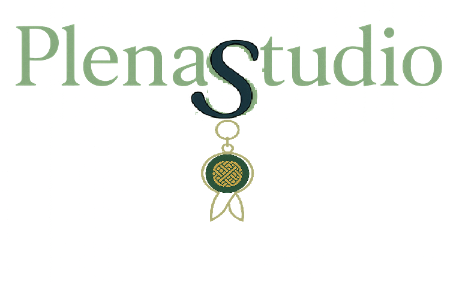

# 💎 Plena Studio - E-Commerce de Joyería

<div align="center">



**Una plataforma moderna de e-commerce especializada en joyería artesanal**

[](package.json)
[](LICENSE)
[](https://reactjs.org/)
[](https://www.typescriptlang.org/)
[](docker-compose.yml)

[🚀 Demo en Vivo](#-demo-rápido) •
[📖 Documentación](#-documentación) •
[🐳 Docker Setup](#-instalación-con-docker) •
[🛠️ Desarrollo](#-desarrollo-local)

</div>

## 📋 Tabla de Contenidos

- [✨ Características](#-características)
- [🏗️ Arquitectura](#️-arquitectura)
- [🚀 Demo Rápido](#-demo-rápido)
- [🐳 Instalación con Docker](#-instalación-con-docker)
- [🛠️ Desarrollo Local](#️-desarrollo-local)
- [📖 Documentación](#-documentación)
- [🧪 Testing](#-testing)
- [📊 Diagramas](#-diagramas)
- [🔧 Scripts Disponibles](#-scripts-disponibles)
- [🤝 Contribuir](#-contribuir)

## ✨ Características

### 🛍️ **Frontend (React + TypeScript)**
- **Catálogo de Productos**: 20+ productos de joyería precargados
- **Carrito Inteligente**: Persistencia local + sincronización con backend
- **Autenticación JWT**: Login/logout con gestión de sesiones
- **Búsqueda Avanzada**: Filtros por categoría y texto
- **Responsive Design**: Bootstrap 5 + diseño móvil-first
- **Gestión de Estado**: Context API + hooks personalizados

### 🔧 **Backend (Node.js + Express + TypeScript)**
- **API RESTful**: Endpoints para auth, carrito, catálogo y búsqueda
- **Base de Datos**: MySQL 8.0 con migraciones automatizadas
- **Seguridad**: JWT tokens, bcrypt para passwords, CORS configurado
- **Middleware**: Autenticación, validación y manejo de errores
- **Email Service**: Nodemailer para formularios de contacto

### 🐳 **Infraestructura (Docker)**
- **Containerización Completa**: Frontend, Backend, Base de datos, Nginx
- **Proxy Reverso**: Nginx para balanceo y serving de archivos estáticos
- **Desarrollo**: Hot-reload y debugging con Docker Compose
- **Producción**: Build optimizado con multi-stage Dockerfiles

## 🏗️ Arquitectura

```
┌─────────────────┐    ┌──────────────────┐    ┌─────────────────┐
│   Frontend      │    │     Backend      │    │    Database     │
│   (React TS)    │◄──►│  (Express TS)    │◄──►│   (MySQL 8.0)   │
│   Puerto 80     │    │   Puerto 3001    │    │   Puerto 3307   │
└─────────────────┘    └──────────────────┘    └─────────────────┘
         ▲                        ▲                        ▲
         │                        │                        │
         └────────────────────────┼────────────────────────┘
                                  │
                         ┌─────────────────┐
                         │      Nginx      │
                         │  (Proxy + SSL)  │
                         │    Puerto 80    │
                         └─────────────────┘
```

**Stack Tecnológico:**
- **Frontend**: React 19, TypeScript, Bootstrap 5, Vite
- **Backend**: Node.js, Express, TypeScript, JWT, bcrypt
- **Base de Datos**: MySQL 8.0, migraciones automáticas
- **Infraestructura**: Docker, Docker Compose, Nginx
- **Testing**: Jest, React Testing Library, Coverage reports

## 🚀 Demo Rápido

### ⚡ Inicio Rápido (Docker)

```bash
# 1. Clonar el repositorio
git clone https://github.com/tu-usuario/plena-studio.git
cd plena-studio

# 2. Levantar todo el sistema con Docker
docker-compose up -d

# 3. Esperar inicialización (30-60 segundos)
docker-compose logs -f

# 4. Acceder a la aplicación
# http://localhost (Frontend)
# http://localhost/api (Backend API)
```

### 🔐 **Credenciales de Prueba:**
- **Email**: `demo@plenastudio.com`
- **Password**: `password`

### 🎯 **Flujo de Prueba:**
1. **Explorar catálogo** → Navegar productos por categorías
2. **Agregar al carrito** → Añadir productos (funciona sin login)
3. **Iniciar sesión** → Usar credenciales de demo
4. **Sincronización** → El carrito local se sincroniza automáticamente
5. **Gestionar carrito** → Editar cantidades, eliminar productos
6. **Cerrar sesión** → El carrito se limpia y persiste en backend

## 🐳 Instalación con Docker

### 📋 **Prerrequisitos**
- [Docker](https://www.docker.com/get-started) (versión 20.10+)
- [Docker Compose](https://docs.docker.com/compose/install/) (versión 2.0+)
- 4GB RAM mínimo

### 🚀 **Producción (Recomendado)**

```bash
# Levantar todos los servicios
docker-compose up -d

# Verificar estado
docker-compose ps

# Ver logs en tiempo real
docker-compose logs -f

# Parar servicios
docker-compose down
```

### 🔧 **Desarrollo (Backend + DB en Docker)**

```bash
# Solo backend y base de datos
docker-compose -f docker-compose.dev.yml up -d

# Frontend en modo desarrollo local
npm install
npm run dev

# Acceso:
# Frontend: http://localhost:3000
# Backend: http://localhost:3001
# Database: localhost:3307
```

### 🧹 **Limpieza Completa**

```bash
# Parar y eliminar todo (incluye volúmenes)
docker-compose down -v

# Eliminar imágenes locales
docker rmi plena-studio-frontend plena-studio-backend
```

## 🛠️ Desarrollo Local

### 📋 **Prerrequisitos**
- [Node.js](https://nodejs.org/) (versión 20+)
- [MySQL](https://www.mysql.com/) (versión 8.0+)
- [Git](https://git-scm.com/)

### ⚙️ **Configuración**

```bash
# 1. Clonar repositorio
git clone https://github.com/tu-usuario/plena-studio.git
cd plena-studio

# 2. Instalar dependencias del frontend
npm install

# 3. Instalar dependencias del backend
cd Backend
npm install
cd ..

# 4. Configurar base de datos
mysql -u root -p < script/create_bd_plena_studio.sql
mysql -u root -p plena-studio < script/insertar_productos_completos.sql

# 5. Configurar variables de entorno
cp Backend/.env.example Backend/.env
# Editar Backend/.env con tu configuración de BD
```

### 🚀 **Ejecutar en Desarrollo**

```bash
# Terminal 1: Backend
cd Backend
npm run dev

# Terminal 2: Frontend
npm run dev

# Acceso:
# Frontend: http://localhost:3000
# Backend: http://localhost:3001
```

## 📖 Documentación

### 📁 **Estructura del Proyecto**

```
PlenaStudio/
├── 📁 src/                      # Frontend React + TypeScript
│   ├── 📁 components/           # Componentes reutilizables
│   ├── 📁 pages/               # Páginas principales
│   ├── 📁 context/             # Context API (CartContext)
│   ├── 📁 hooks/               # Hooks personalizados (useAuth)
│   ├── 📁 services/            # Servicios API (auth, cart)
│   └── 📁 types/               # Definiciones TypeScript
├── 📁 Backend/                  # Backend Express + TypeScript
│   ├── 📁 src/
│   │   ├── 📁 api/             # Routes y Controllers
│   │   ├── 📁 services/        # Lógica de negocio
│   │   ├── 📁 middlewares/     # Middleware JWT, CORS
│   │   └── 📄 app.ts           # Configuración Express
├── 📁 script/                   # Scripts SQL y migraciones
├── 📁 Diagramas/               # Documentación PlantUML
├── 📁 public/                  # Assets estáticos
├── 🐳 docker-compose.yml       # Configuración Docker
├── 🐳 Dockerfile.frontend      # Build del frontend
└── 📖 README.md                # Este archivo
```

### 🔗 **Enlaces Importantes**
- [📖 Guía de Demo](DEMO-GUIDE.md) - Tutorial paso a paso
- [🐳 Docker Setup](README-Docker.md) - Configuración detallada
- [📊 Diagramas](Diagramas/PUML/README.md) - Arquitectura del sistema
- [🧪 Reportes de Testing](coverage/) - Cobertura de pruebas

## 🧪 Testing

### 🏃‍♂️ **Ejecutar Pruebas**

```bash
# Todas las pruebas
npm test

# Con cobertura
npm test -- --coverage

# Modo watch (desarrollo)
npm test -- --watch

# Pruebas específicas
npm test -- RegisterForm.test.tsx
```

### 📊 **Cobertura Actual**
- **Statements**: 85%+
- **Branches**: 80%+
- **Functions**: 90%+
- **Lines**: 85%+

### 🧪 **Tipos de Pruebas**
- **Unitarias**: Componentes React individuales
- **Integración**: Context + Services + API calls
- **E2E**: Flujos completos de usuario (carrito, auth)

## 📊 Diagramas

El proyecto incluye documentación visual completa:

### 🏗️ **Diagramas de Arquitectura**
- **[Componentes del Sistema](Diagramas/PUML/01-componentes-sistema.puml)**: Docker + microservicios
- **[API REST Endpoints](Diagramas/PUML/02-endpoints-rest-api.puml)**: Documentación completa de API
- **[Frontend Components](Diagramas/PUML/03-componentes-frontend.puml)**: Arquitectura React
- **[Flujo de Datos](Diagramas/PUML/04-flujo-datos-sistema.puml)**: Interacciones Usuario ↔ Sistema
- **[Base de Datos](Diagramas/PUML/05-diagrama-base-datos.puml)**: Esquema y relaciones

### 🔍 **Visualizar Diagramas**
```bash
# Con VS Code + extensión PlantUML
code Diagramas/PUML/

# Online
# Copiar contenido → http://www.plantuml.com/plantuml/uml/

# Exportar PNG
java -jar plantuml.jar -tpng Diagramas/PUML/*.puml
```

## 🔧 Scripts Disponibles

### 📦 **Frontend**
```bash
npm run dev         # Desarrollo con hot-reload
npm run build       # Build para producción
npm run preview     # Preview del build
npm test           # Ejecutar pruebas Jest
```

### 🔧 **Backend**
```bash
npm run dev         # Desarrollo con ts-node
npm run build       # Compilar TypeScript
npm run start       # Ejecutar build compilado
```

### 🐳 **Docker (VS Code Tasks)**
```bash
# Usar Ctrl+Shift+P → "Tasks: Run Task"
- Docker: Start Plena Studio
- Docker: Stop Plena Studio  
- Docker: View All Logs
- Docker: Backend Logs Only
- Docker: Dev Mode (Backend + DB only)
- Docker: Clean All
```

### 🔧 **Utilidades**
```bash
./docker.ps1        # Script PowerShell para Windows
./docker.sh         # Script Bash para Linux/Mac
```

## 🚀 Despliegue

### 🌐 **Producción con Docker**

```bash
# 1. Configurar variables de entorno para producción
cp .env.docker .env.production

# 2. Build y deploy
docker-compose -f docker-compose.yml up -d --build

# 3. Verificar servicios
docker-compose ps
curl http://localhost/api
```

### ☁️ **Cloud Deploy (Ejemplo)**

```bash
# Docker Registry
docker tag plena-studio-frontend:latest registry.com/plena-frontend
docker push registry.com/plena-frontend

# Kubernetes
kubectl apply -f k8s/

# Vercel/Netlify (solo frontend)
npm run build
# Deploy carpeta ./build
```

## 🤝 Contribuir

### 🌟 **¡Contribuciones bienvenidas!**

1. **Fork** del repositorio
2. **Crear** rama feature (`git checkout -b feature/AmazingFeature`)
3. **Commit** cambios (`git commit -m 'Add: AmazingFeature'`)
4. **Push** a la rama (`git push origin feature/AmazingFeature`)
5. **Abrir** Pull Request

### 📝 **Guías de Contribución**
- **Código**: Seguir convenciones TypeScript + Prettier
- **Commits**: Usar [Conventional Commits](https://www.conventionalcommits.org/)
- **Testing**: Agregar pruebas para nuevas funcionalidades
- **Documentación**: Actualizar README y diagramas si es necesario

### 🐛 **Reportar Bugs**
- Usar [GitHub Issues](../../issues)
- Incluir pasos para reproducir
- Adjuntar logs y screenshots
- Especificar versión y entorno

## 📄 Licencia

Este proyecto está bajo la Licencia ISC. Ver [LICENSE](LICENSE) para más detalles.

## 🙏 Agradecimientos

- **React Team** - Por el increíble framework
- **Express.js** - Por el backend minimalista y potente  
- **Docker** - Por simplificar el deployment
- **Bootstrap** - Por el sistema de diseño
- **PlantUML** - Por la documentación visual
- **VS Code** - Por el mejor IDE de desarrollo

---

<div align="center">

**¿Te gusta el proyecto? ⭐ Dale una estrella en GitHub**

[🚀 Empezar](#-demo-rápido) •
[📖 Docs](Diagramas/PUML/README.md) •
[🐛 Issues](../../issues) •
[💬 Discussions](../../discussions)

**Hecho con ❤️ para la comunidad de e-commerce**

</div>
